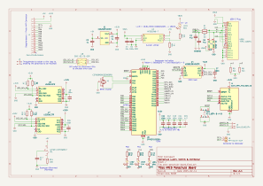

# ARES Parachute Board

This repository contains the design files for the parachute board for the ARES module at HSLU. Use as reference material or to order your own variation.

# Errata

# To add

# Ordering

All components other than JP1, J5, J6 (all of them available in Werkstatt) and C17 (Supercap) are designed to be manufactured placed from JLCPCB. 

The outputs needed to order can be generated from [Bouni's JLCPCB Kicad Tools](https://github.com/Bouni/kicad-jlcpcb-tools) - the currently most recent outputs can be found in the folder `jlcpcb/production_files`. The `.zip` contains the gerbers, `BOM_` is the bill of materials, `CPL_` is the placement file - those are the files asked for when ordering through JLCPCB. Check parts placement and place the order then. 

The order requires 'standard assembly' rather than 'Economic assembly' due to the small size of the Accelerometers.

# Not yet tested

- USB
- SPI
