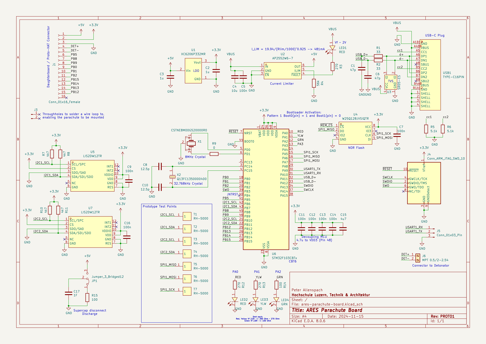

# Schema Prototyp-1

# Errata

- Add Pin 1 identifier to debug header
- Graphic indicating XYZ for Accelerometers is wrong, Z is correct, x should point left, y down
    - if board is upright, Z positive
    - if tilted left (debug connector side down), X positive
    - if tilted down (breadboard area down), y positive
- RESET button should be added (pull NRST to GND, NO), because SWD can be disabled, this happens very quick, too fast for the debug adapter's reset to still be effective
- SPI CS is not connected, check on prototype board where CS has been connected to PB5 and then reroute it to an open Pin on MCU directly.
- LED Resistors
    - Red, Yellow, 560 Ohm
    - Green 2.2kOhm

# To add

- DIP-Switch to enable/disable Accelerometer I2C connection

# Ordering

All components other than JP1, J5, J6 (all of them available in Werkstatt) and C17 (Supercap) are designed to be manufactured placed from JLCPCB. 

The outputs needed to order can be generated from [Bouni's JLCPCB Kicad Tools](https://github.com/Bouni/kicad-jlcpcb-tools) - the currently most recent outputs can be found in the folder `jlcpcb/production_files`. The `.zip` contains the gerbers, `BOM_` is the bill of materials, `CPL_` is the placement file - those are the files asked for when ordering through JLCPCB. Check parts placement and place the order then. 

The order requires 'standard assembly' rather than 'Economic assembly' due to the small size of the Accelerometers.

# Untested

- USB
- SPI

# Ideas
- USB debugging with sidechannel?
- Other debug header?
- Debugging on board?
